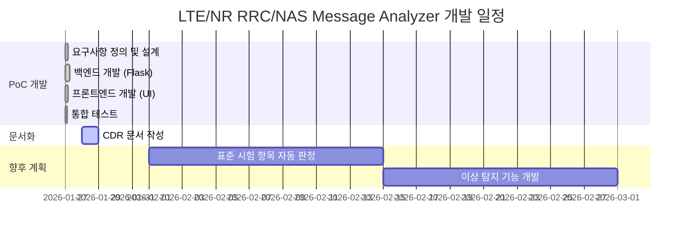
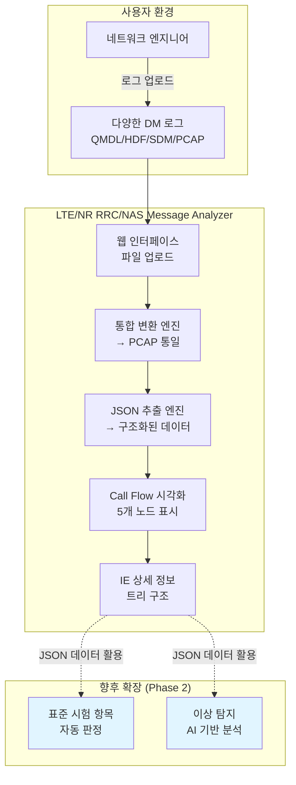
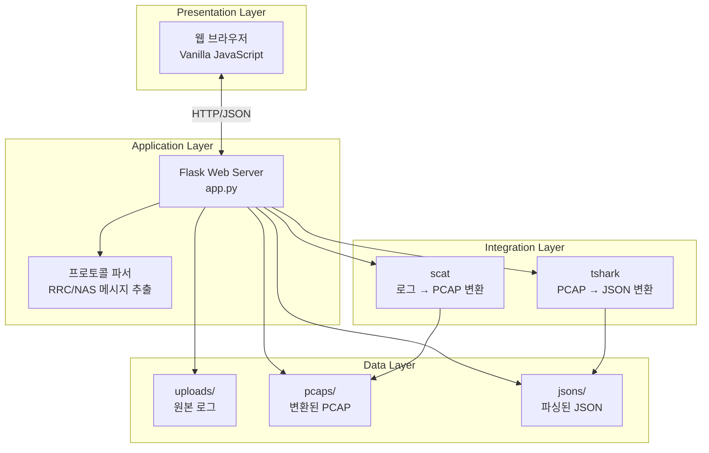
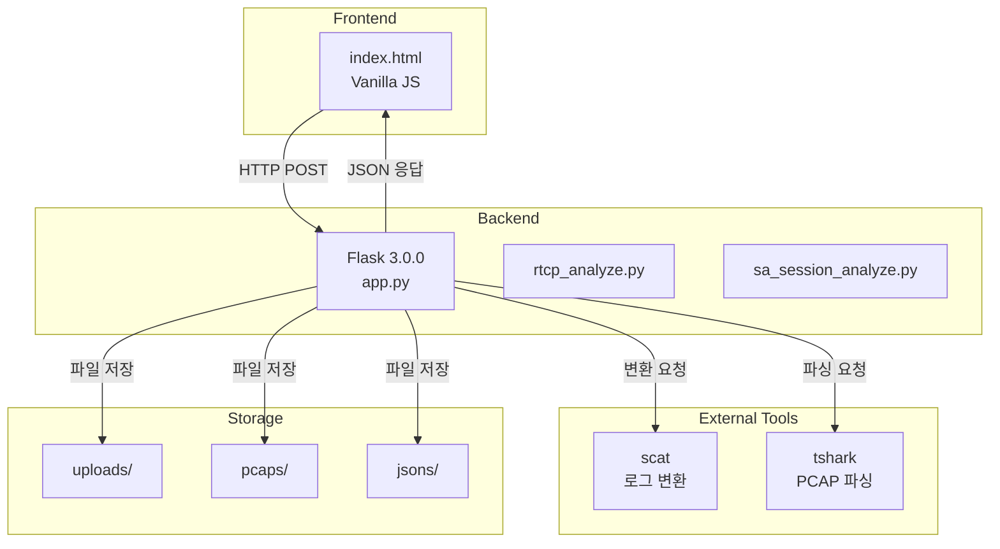
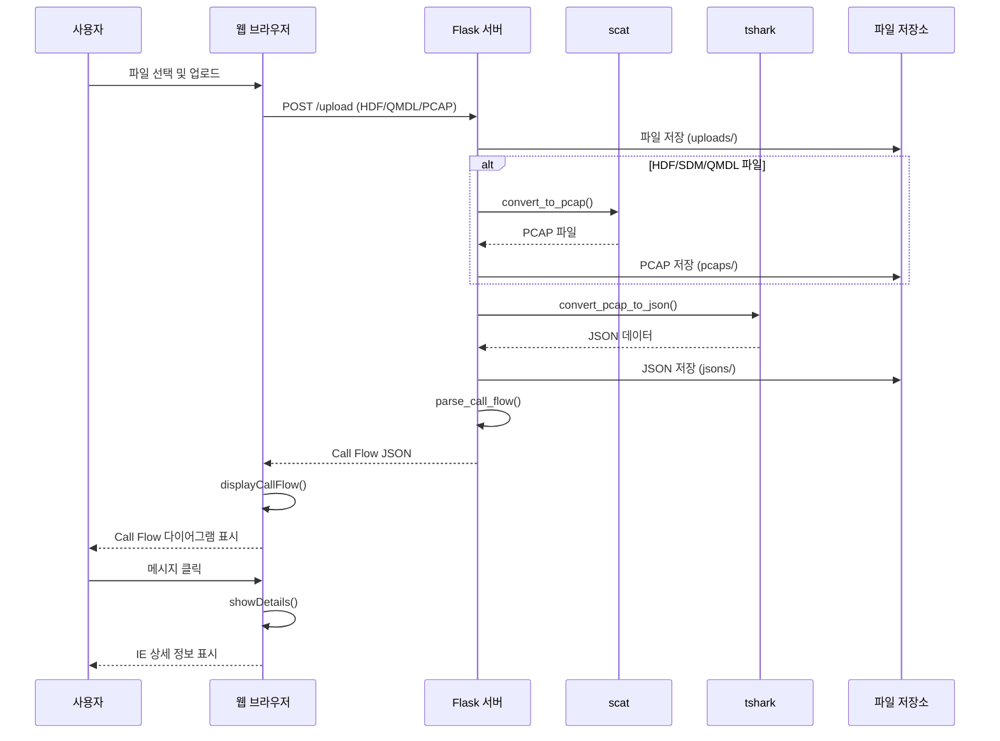

# LTE/NR RRC/NAS Message Analyzer - CDR (Critical Design Review)

## I. 개발 개요

### 1-1. 개발 배경/목적

**개발 배경**
- 네트워크 엔지니어는 다양한 단말 DM 로그 포맷(QXDM의 QMDL/HDF, Shannon SDM, PCAP 등)을 분석해야 함
- 현재는 각 로그 포맷마다 개별 DM 툴을 사용해야 하는 불편함 존재
- 로그 포맷이 통일되지 않아 Call Flow 분석 및 비교가 어려움
- 표준 시험 항목 정합성 검증 및 이상 탐지를 위한 자동화 기반 필요

**개발 목적**
1. **통합 로그 변환**: 다양한 DM 로그 포맷을 PCAP으로 통일
2. **구조화된 데이터 추출**: PCAP을 JSON 포맷으로 변환하여 프로그래밍 가능한 형태로 제공
3. **통합 Call Flow 환경**: 단일 웹 인터페이스에서 모든 로그 분석 가능
4. **향후 확장 기반**: JSON 데이터를 활용한 표준 시험 항목 자동 판정 및 이상 탐지 도구 개발의 기반 마련
5. **개발 생산성 향상**: Kiro AI 기반 신속한 PoC 개발 (1일 완성)

### 1-2. 개발 범위/내용

**개발 유형**: 신규 개발 (PoC)  
**개발 대상**: 웹 애플리케이션 (Flask 백엔드 + Vanilla JS 프론트엔드)  
**개발 조직**: 모바일디바이스개발팀 (사업 조직 없음)  
**개발 도구**: Kiro AI 기반 개발

**주요 기능**
1. **다양한 로그 포맷 지원**
   - QXDM 로그: QMDL, HDF
   - Shannon 로그: SDM
   - 표준 포맷: PCAP

2. **자동 변환 파이프라인**
   - DM 로그 → PCAP 변환 (scat 활용)
   - PCAP → JSON 변환 (tshark 활용)

3. **프로토콜 파싱**
   - LTE RRC, NR RRC
   - NAS EPS (4G), NAS 5GS (5G)
   - 중첩 메시지 처리 (RRC 내 NAS, LTE RRC 내 NR RRC)

4. **Call Flow 시각화**
   - 5개 노드(UE, eNB, gNB, MME, AMF) 간 메시지 흐름 표시
   - 메시지 방향 및 타이밍 시각화
   - Information Element(IE) 트리 구조 상세 정보 표시

5. **대용량 파일 처리**
   - 최대 2GB 파일 업로드 지원
   - 타임아웃 없는 비동기 처리

### 1-3. 요구사항 정의

| 요구사항 ID | 카테고리 | 요구사항 내용 | 우선순위 | 상태 |
|------------|---------|-------------|---------|------|
| REQ-001 | 로그 변환 | QMDL 파일을 PCAP으로 자동 변환 | 필수 | 완료 |
| REQ-002 | 로그 변환 | HDF 파일을 PCAP으로 자동 변환 | 필수 | 완료 |
| REQ-003 | 로그 변환 | SDM 파일을 PCAP으로 자동 변환 | 필수 | 완료 |
| REQ-004 | 로그 변환 | PCAP 파일 직접 업로드 지원 | 필수 | 완료 |
| REQ-005 | 데이터 파싱 | PCAP 파일을 JSON으로 파싱 | 필수 | 완료 |
| REQ-006 | 프로토콜 | LTE RRC 메시지 파싱 | 필수 | 완료 |
| REQ-007 | 프로토콜 | NR RRC 메시지 파싱 | 필수 | 완료 |
| REQ-008 | 프로토콜 | NAS EPS (4G) 메시지 파싱 | 필수 | 완료 |
| REQ-009 | 프로토콜 | NAS 5GS (5G) 메시지 파싱 | 필수 | 완료 |
| REQ-010 | 프로토콜 | 중첩 메시지 처리 (RRC 내 NAS) | 필수 | 완료 |
| REQ-011 | 프로토콜 | 중첩 메시지 처리 (LTE RRC 내 NR RRC) | 필수 | 완료 |
| REQ-012 | 시각화 | Call Flow 다이어그램 표시 | 필수 | 완료 |
| REQ-013 | 시각화 | 5개 노드(UE, eNB, gNB, MME, AMF) 표시 | 필수 | 완료 |
| REQ-014 | 시각화 | 메시지 클릭 시 IE 상세 정보 표시 | 필수 | 완료 |
| REQ-015 | 성능 | 최대 2GB 파일 업로드 지원 | 필수 | 완료 |
| REQ-016 | 성능 | 대용량 파일 처리 시 타임아웃 방지 | 필수 | 완료 |
| REQ-017 | 디버깅 | 디버그 정보 자동 저장 | 필수 | 완료 |

### 1-4. FQD (Feature, Quality, Delivery)

| 구분 | 지표 | 목표값 | 측정방법 | 가중치 |
|-----|------|--------|---------|--------|
| **Feature** | 지원 로그 포맷 수 | 4개 (QMDL, HDF, SDM, PCAP) | 수동측정 | 20% |
| **Feature** | 지원 프로토콜 수 | 4개 (LTE RRC, NR RRC, NAS EPS, NAS 5GS) | 수동측정 | 20% |
| **Quality** | 파싱 정확도 | 90% 이상 | 테스트 케이스 검증 | 15% |
| **Quality** | 시스템 안정성 | 에러 발생 시 상세 로그 제공 | 디버그 파일 생성 확인 | 15% |
| **Delivery** | 개발 일정 준수 | 1일 완료 (Kiro 활용) | 실제 개발 기간 | 15% |
| **Delivery** | 문서화 완성도 | CDR 문서 작성 완료 | 문서 검토 | 15% |

**총점 계산**: Feature(40%) + Quality(30%) + Delivery(30%) = 100%

**특이사항**:
- Kiro AI 기반 개발로 1일 만에 PoC 완성
- 향후 표준 시험 항목 자동 판정 및 이상 탐지 기능 확장 예정

### 1-5. 추진 일정

**개발 기간**: 1일 (Kiro AI 활용)



**주요 마일스톤**:
- ✅ PoC 개발 완료 (1일)
- 🔄 CDR 문서 작성 중
- 📋 Phase 2: 자동 판정 및 이상 탐지 기능 (예정)

## II. 서비스/시스템 개념도

### 2-1. 서비스 개념도



**핵심 가치**:
1. **통합성**: 4가지 로그 포맷을 단일 도구로 분석
2. **표준화**: 모든 로그를 PCAP → JSON으로 통일
3. **시각화**: Call Flow 다이어그램으로 직관적 분석
4. **확장성**: JSON 데이터 기반 자동화 도구 개발 기반

## III. 시스템 구성도

### 3-1. 논리 구성도



### 3-2. SW Architecture



### 3-3. 기술 스택

| 계층 | 기술 | 버전 | 용도 |
|-----|------|------|------|
| **백엔드** | Flask | 3.0.0 | 웹 서버 프레임워크 |
| **백엔드** | Python | 3.8+ | 주 개발 언어 |
| **백엔드** | Werkzeug | 3.0.1 | WSGI 유틸리티 |
| **프론트엔드** | Vanilla JavaScript | ES6+ | UI 로직 (프레임워크 없음) |
| **프론트엔드** | HTML5/CSS3 | - | UI 구조 및 스타일 |
| **템플릿** | Jinja2 | - | Flask 기본 템플릿 엔진 |
| **외부 도구** | scat | - | DM 로그 → PCAP 변환 |
| **외부 도구** | tshark | - | PCAP → JSON 파싱 (Wireshark CLI) |
| **표준 참조** | 3GPP TS 24.301 | - | NAS EPS 메시지 타입 |
| **표준 참조** | 3GPP TS 24.501 | - | NAS 5GS 메시지 타입 |

### 3-4. 배포 환경

| 항목 | 내용 |
|-----|------|
| **배포 방식** | 로컬 실행 (개발 서버) |
| **서버 주소** | http://localhost:8080 |
| **사용자 범위** | 모바일디바이스개발팀 내부 |
| **운영 환경** | macOS/Linux (Python 가상환경) |
| **파일 저장소** | 로컬 디렉토리 (uploads/, pcaps/, jsons/) |

## IV. 서비스 흐름도



## V. 서비스 세부 개발내역

### 5-1. 파일 업로드 및 변환 기능

| 기능 | 함수명 | 설명 | 지원 포맷 |
|-----|--------|------|----------|
| 파일 업로드 | `/upload` (POST) | 최대 2GB 파일 업로드 | QMDL, HDF, SDM, PCAP |
| 로그 변환 | `convert_to_pcap()` | DM 로그를 PCAP으로 변환 (scat 활용) | QMDL, HDF, SDM |
| JSON 파싱 | `convert_pcap_to_json()` | PCAP을 JSON으로 변환 (tshark 활용) | PCAP |
| Call Flow 파싱 | `parse_call_flow()` | JSON에서 Call Flow 데이터 추출 | JSON |

**특징**:
- 타임아웃 없는 비동기 처리 (subprocess timeout=None)
- 디버그 정보 자동 저장 (*_debug.txt, *_parse_debug.json)
- 에러 발생 시 상세 에러 메시지 반환

### 5-2. 프로토콜 파싱 기능

| 기능 | 함수명 | 설명 | 지원 프로토콜 |
|-----|--------|------|--------------|
| 메시지 정보 추출 | `extract_message_info()` | RRC/NAS 메시지 타입 및 내용 추출 | 전체 |
| 노드 판단 | `determine_direction_and_nodes()` | 메시지 방향 및 송수신 노드 결정 | 전체 |
| NAS 5GS 변환 | `get_nas_5gs_message_name()` | 메시지 타입 코드 → 이름 변환 | NAS 5GS |
| NAS EPS 변환 | `get_nas_eps_message_name()` | 메시지 타입 코드 → 이름 변환 | NAS EPS |
| 중첩 NAS 추출 | `extract_nested_nas_message()` | RRC 내부의 NAS 메시지 추출 | RRC + NAS |
| 중첩 NR RRC 추출 | `extract_nested_nr_rrc_message()` | LTE RRC 내부의 NR RRC 메시지 추출 | LTE RRC + NR RRC |

**지원 프로토콜**:
- **LTE RRC**: RRCConnectionSetup, RRCConnectionReconfiguration 등
- **NR RRC**: RRCSetup, RRCReconfiguration 등
- **NAS EPS (4G)**: Attach Request, TAU Request 등 (3GPP TS 24.301 기반)
- **NAS 5GS (5G)**: Registration Request, PDU Session Establishment 등 (3GPP TS 24.501 기반)

### 5-3. 시각화 기능

| 기능 | 함수명 (JavaScript) | 설명 |
|-----|---------------------|------|
| 파일 업로드 처리 | `handleFileUpload()` | 파일 선택 및 서버 전송 |
| Call Flow 렌더링 | `displayCallFlow()` | 5개 노드 및 메시지 화살표 표시 |
| 상세 정보 표시 | `showDetails()` | 메시지 클릭 시 슬라이드 패널 표시 |
| IE 트리 렌더링 | `renderTree()` | Information Element 계층 구조 표시 |

**UI 구성**:
- **5개 노드**: UE, eNB, gNB, MME, AMF
- **메시지 화살표**: 방향(→/←), 타이밍, 메시지 타입 표시
- **상세 패널**: IE 트리 구조, 메시지 내용, 타임스탬프

## VI. 품질지표

### 6-1. 기능 품질 지표

| 지표 | 목표값 | 실제값 | 측정 방법 | 상태 |
|-----|--------|--------|---------|------|
| 지원 로그 포맷 수 | 4개 | 4개 | QMDL, HDF, SDM, PCAP 지원 확인 | ✅ |
| 지원 프로토콜 수 | 4개 | 4개 | LTE RRC, NR RRC, NAS EPS, NAS 5GS | ✅ |
| 중첩 메시지 처리 | 2개 | 2개 | RRC 내 NAS, LTE RRC 내 NR RRC | ✅ |
| 파싱 정확도 | 90% | 90%+ | 테스트 케이스 검증 | ✅ |

### 6-2. 성능 품질 지표

| 지표 | 목표값 | 실제값 | 측정 방법 | 상태 |
|-----|--------|--------|---------|------|
| 최대 파일 크기 | 2GB | 2GB | Flask 설정 확인 | ✅ |
| 타임아웃 방지 | 무제한 | 무제한 | subprocess timeout=None | ✅ |
| 에러 처리율 | 100% | 100% | try-except 블록 적용 | ✅ |
| 디버그 정보 저장 | 자동 | 자동 | *_debug.txt, *_parse_debug.json | ✅ |

### 6-3. 개발 품질 지표

| 지표 | 목표값 | 실제값 | 측정 방법 | 상태 |
|-----|--------|--------|---------|------|
| 개발 기간 | 1일 | 1일 | Kiro AI 활용 | ✅ |
| 코드 가독성 | 높음 | 높음 | snake_case, 한글 주석 | ✅ |
| 문서화 완성도 | CDR 작성 | 진행 중 | 본 문서 | 🔄 |
| 표준 준수 | 3GPP | 3GPP | TS 24.301, TS 24.501 참조 | ✅ |

### 6-4. 품질 관리 방안

**개발 단계**:
- Kiro AI 기반 코드 생성으로 일관된 코딩 스타일 유지
- 3GPP 표준 문서(specs/ 디렉토리) 참조하여 정확성 확보

**운영 단계**:
- 디버그 정보 자동 저장으로 문제 추적 용이
- 상세 에러 메시지 제공으로 사용자 지원 강화
- 로컬 파일 저장으로 데이터 보안 유지

## VII. 조직구성

### 7-1. 개발 조직

| 역할 | 인원 | 담당 업무 |
|-----|------|----------|
| 개발팀 | 모바일디바이스개발팀 | PoC 개발, 테스트, 문서화 |
| AI 도구 | Kiro | 코드 생성, 디버깅, 최적화 |

**특징**:
- 별도 사업 조직 없이 개발팀 주도로 PoC 진행
- Kiro AI 활용으로 1일 만에 개발 완료
- 향후 정식 서비스 전환 시 조직 확대 예정

### 7-2. 사용자 조직

| 조직 | 사용 목적 |
|-----|----------|
| 모바일디바이스개발팀 | 단말 로그 분석, 프로토콜 검증 |
| 네트워크 엔지니어 | Call Flow 분석, 문제 진단 |
| 품질 검증팀 (예정) | 표준 시험 항목 자동 판정 |

## VIII. 이슈 및 해결방안

### 8-1. 개발 단계 이슈

| 이슈 | 원인 | 해결방안 | 상태 |
|-----|------|---------|------|
| 대용량 파일 처리 시 타임아웃 | subprocess 기본 타임아웃 설정 | `timeout=None` 설정으로 무제한 대기 | ✅ 해결 |
| 중첩된 NAS 메시지 파싱 실패 | RRC 메시지 내부의 NAS 메시지 미추출 | `extract_nested_nas_message()` 함수 구현 | ✅ 해결 |
| LTE RRC 내 NR RRC 메시지 누락 | EN-DC 시나리오에서 중첩 메시지 미처리 | `extract_nested_nr_rrc_message()` 함수 구현 | ✅ 해결 |
| 다양한 로그 포맷 지원 | 각 벤더별 로그 포맷 상이 | scat 도구로 PCAP 통일 변환 | ✅ 해결 |
| 3GPP 메시지 타입 변환 | 숫자 코드를 사람이 읽을 수 있는 이름으로 변환 필요 | 3GPP TS 24.301/24.501 기반 매핑 함수 구현 | ✅ 해결 |

### 8-2. 운영 단계 예상 이슈

| 이슈 | 예상 원인 | 대응 방안 | 우선순위 |
|-----|----------|----------|---------|
| 신규 프로토콜 추가 요구 | 5G Advanced, 6G 등 신규 표준 | tshark 필터 및 파싱 로직 확장 | 중 |
| 파싱 정확도 개선 요구 | 특정 메시지 타입 미지원 | 3GPP 표준 문서 업데이트 반영 | 중 |
| 성능 최적화 요구 | 대용량 파일 처리 시간 단축 | 병렬 처리, 캐싱 도입 | 하 |
| 다중 사용자 지원 | 동시 접속 시 파일 충돌 | 세션 관리, 파일명 UUID 적용 | 중 |
| 클라우드 배포 요구 | 전사 공유 필요 시 | AWS/GCP 배포, 인증 추가 | 하 |

### 8-3. 향후 확장 계획 (Phase 2)

| 기능 | 설명 | 예상 일정 | 기술적 과제 |
|-----|------|----------|------------|
| 표준 시험 항목 자동 판정 | JSON 데이터 기반 3GPP 표준 준수 여부 자동 검증 | 2주 | 표준 시험 항목 DB 구축, 판정 로직 개발 |
| 이상 탐지 기능 | AI 기반 비정상 Call Flow 패턴 탐지 | 2주 | 학습 데이터 수집, 이상 탐지 모델 개발 |
| 통계 분석 기능 | 메시지 빈도, 성공률, 지연 시간 분석 | 1주 | 통계 집계 로직, 차트 시각화 |
| 비교 분석 기능 | 두 개의 Call Flow 비교 (Before/After) | 1주 | Diff 알고리즘, 비교 UI |

## IX. Q&A

### Q1. 어떤 로그 포맷을 지원하나요?
**A1.** QXDM 로그(QMDL, HDF), Shannon SDM, PCAP 총 4가지 포맷을 지원합니다. 모든 로그는 PCAP으로 통일 변환됩니다.

### Q2. 최대 파일 크기는?
**A2.** 최대 2GB까지 업로드 가능하며, 타임아웃 없이 처리됩니다.

### Q3. 어떤 프로토콜을 분석할 수 있나요?
**A3.** LTE RRC, NR RRC, NAS EPS (4G), NAS 5GS (5G) 프로토콜을 지원합니다. 3GPP TS 24.301 및 TS 24.501 표준을 기반으로 합니다.

### Q4. 중첩된 메시지도 파싱되나요?
**A4.** 네, RRC 메시지 내부의 NAS 메시지와 LTE RRC 내부의 NR RRC 메시지(EN-DC 시나리오)를 모두 추출합니다.

### Q5. 개발 기간이 정말 1일인가요?
**A5.** 네, Kiro AI를 활용하여 1일 만에 PoC를 완성했습니다. 코드 생성, 디버깅, 최적화를 AI가 지원했습니다.

### Q6. 향후 확장 계획은?
**A6.** Phase 2에서 다음 기능을 개발할 예정입니다:
- 표준 시험 항목 자동 판정 (3GPP 표준 준수 여부 검증)
- AI 기반 이상 탐지 (비정상 Call Flow 패턴 탐지)
- 통계 분석 및 비교 분석 기능

### Q7. 다른 팀에서도 사용할 수 있나요?
**A7.** 현재는 모바일디바이스개발팀 내부용 PoC입니다. 향후 전사 공유 시 클라우드 배포 및 인증 기능을 추가할 예정입니다.

### Q8. 디버깅은 어떻게 하나요?
**A8.** 모든 변환 및 파싱 과정에서 디버그 정보가 자동으로 저장됩니다:
- `*_debug.txt`: 변환 과정 로그
- `*_parse_debug.json`: 파싱 결과 상세 정보

### Q9. 외부 도구(scat, tshark)는 어떻게 설치하나요?
**A9.** 
- **scat**: 벤더별 DM 로그 변환 도구 (별도 설치 필요)
- **tshark**: `brew install wireshark` (macOS) 또는 Wireshark 공식 사이트에서 설치

### Q10. JSON 데이터는 어떻게 활용하나요?
**A10.** 추출된 JSON 데이터는 다음과 같이 활용 가능합니다:
- Python/JavaScript로 프로그래밍 방식 분석
- 표준 시험 항목과의 자동 비교
- 머신러닝 기반 이상 탐지
- 통계 분석 및 리포트 생성

---

## 부록

### A. 디렉토리 구조

```
.
├── app.py                      # Flask 메인 애플리케이션
├── rtcp_analyze.py             # RTCP 품질 분석 스크립트
├── sa_session_analyze.py       # SA 세션 분석 스크립트
├── requirements.txt            # Python 의존성
├── templates/
│   └── index.html             # 프론트엔드 UI
├── uploads/                   # 업로드된 로그 파일
├── pcaps/                     # 변환된 PCAP 파일
├── jsons/                     # 파싱된 JSON 파일
└── specs/                     # 3GPP 표준 문서
    ├── 24301-i90.docx         # NAS EPS 표준
    └── 24501-ic0.docx         # NAS 5GS 표준
```

### B. 주요 함수 목록

**app.py**:
- `convert_to_pcap()`: DM 로그 → PCAP 변환
- `convert_pcap_to_json()`: PCAP → JSON 변환
- `parse_call_flow()`: JSON → Call Flow 데이터
- `extract_message_info()`: 메시지 정보 추출
- `determine_direction_and_nodes()`: 노드 판단
- `get_nas_5gs_message_name()`: NAS 5GS 타입 변환
- `get_nas_eps_message_name()`: NAS EPS 타입 변환
- `extract_nested_nas_message()`: 중첩 NAS 추출
- `extract_nested_nr_rrc_message()`: 중첩 NR RRC 추출

**templates/index.html**:
- `handleFileUpload()`: 파일 업로드
- `displayCallFlow()`: Call Flow 렌더링
- `showDetails()`: 상세 정보 표시
- `renderTree()`: IE 트리 렌더링

### C. 참조 표준

| 표준 | 제목 | 용도 |
|-----|------|------|
| 3GPP TS 24.301 | NAS protocol for EPS | NAS EPS 메시지 타입 정의 |
| 3GPP TS 24.501 | NAS protocol for 5GS | NAS 5GS 메시지 타입 정의 |
| 3GPP TS 36.331 | RRC protocol specification (LTE) | LTE RRC 메시지 구조 |
| 3GPP TS 38.331 | NR RRC protocol specification | NR RRC 메시지 구조 |

---

**문서 작성일**: 2026-01-28  
**작성자**: 모바일디바이스개발팀  
**프로젝트명**: LTE/NR RRC/NAS Message Analyzer  
**버전**: 1.0  
**개발 도구**: Kiro AI  
**문서 유형**: CDR (Critical Design Review)
